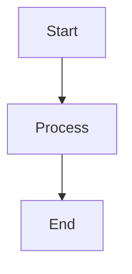
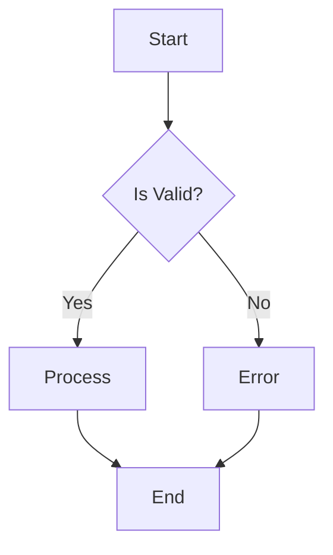
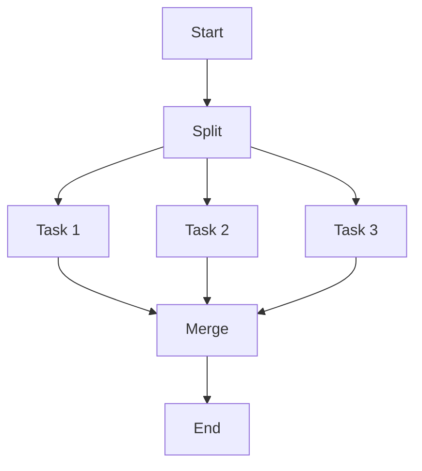
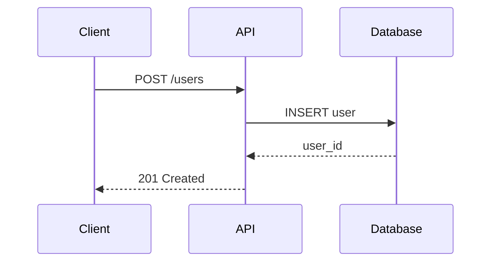
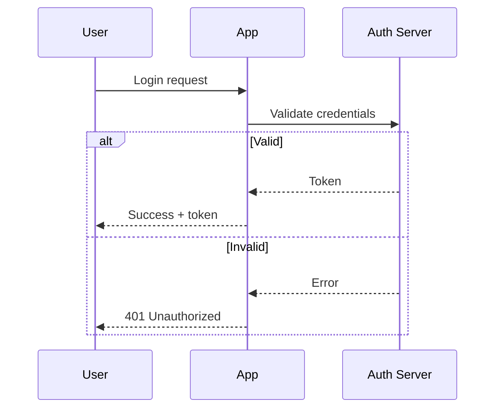
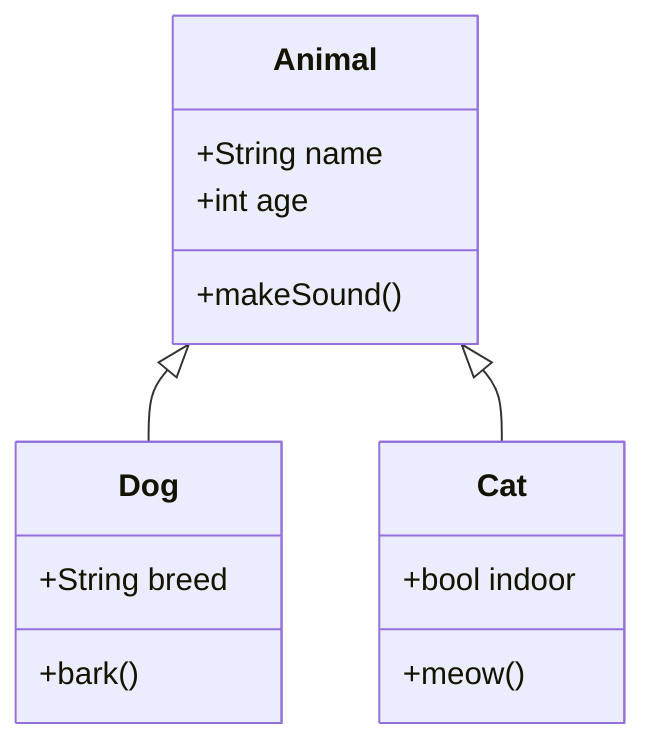

# Examples

Common diagram patterns with both Mermaid and JSON representations.

## Flowcharts

### Simple Linear Flow



**JSON:**
```json
{
  "nodes": [
    {"id": "a", "type": "pill", "label": "Start", "x": 100, "y": 50, "color": "#9ece6a"},
    {"id": "b", "type": "rect", "label": "Process", "x": 85, "y": 130},
    {"id": "c", "type": "pill", "label": "End", "x": 100, "y": 210}
  ],
  "connections": [
    {"id": "c1", "from": "a", "to": "b"},
    {"id": "c2", "from": "b", "to": "c"}
  ]
}
```

### Decision Flow (If/Else)



**JSON:**
```json
{
  "nodes": [
    {"id": "start", "type": "pill", "label": "Start", "x": 200, "y": 50, "color": "#9ece6a"},
    {"id": "check", "type": "diamond", "label": "Is Valid?", "x": 180, "y": 130, "color": "#e0af68"},
    {"id": "process", "type": "rect", "label": "Process", "x": 80, "y": 230},
    {"id": "error", "type": "rect", "label": "Error", "x": 280, "y": 230, "color": "#f7768e"},
    {"id": "end", "type": "pill", "label": "End", "x": 200, "y": 330}
  ],
  "connections": [
    {"id": "c1", "from": "start", "to": "check"},
    {"id": "c2", "from": "check", "to": "process", "label": "Yes"},
    {"id": "c3", "from": "check", "to": "error", "label": "No"},
    {"id": "c4", "from": "process", "to": "end"},
    {"id": "c5", "from": "error", "to": "end"}
  ]
}
```

### Parallel Processes



---

## Architecture Diagrams

### Three-Tier Architecture

```json
{
  "nodes": [
    {"id": "g1", "type": "container", "label": "Presentation", "x": 50, "y": 30, "width": 400, "height": 100, "outlineColor": "#9ece6a"},
    {"id": "web", "type": "rect", "label": "Web App", "x": 80, "y": 60},
    {"id": "mobile", "type": "rect", "label": "Mobile App", "x": 220, "y": 60},
    
    {"id": "g2", "type": "container", "label": "Business Logic", "x": 50, "y": 160, "width": 400, "height": 100, "outlineColor": "#7aa2f7"},
    {"id": "api", "type": "rect", "label": "API Gateway", "x": 80, "y": 190},
    {"id": "auth", "type": "rect", "label": "Auth Service", "x": 220, "y": 190},
    {"id": "worker", "type": "rect", "label": "Workers", "x": 340, "y": 190, "width": 80},
    
    {"id": "g3", "type": "container", "label": "Data", "x": 50, "y": 290, "width": 400, "height": 100, "outlineColor": "#bb9af7"},
    {"id": "db", "type": "circle", "label": "DB", "x": 100, "y": 310, "width": 60, "height": 60},
    {"id": "cache", "type": "circle", "label": "Cache", "x": 200, "y": 310, "width": 60, "height": 60},
    {"id": "queue", "type": "circle", "label": "Queue", "x": 300, "y": 310, "width": 60, "height": 60}
  ],
  "connections": [
    {"id": "c1", "from": "web", "to": "api"},
    {"id": "c2", "from": "mobile", "to": "api"},
    {"id": "c3", "from": "api", "to": "auth"},
    {"id": "c4", "from": "api", "to": "db"},
    {"id": "c5", "from": "api", "to": "cache"},
    {"id": "c6", "from": "worker", "to": "queue"},
    {"id": "c7", "from": "worker", "to": "db"}
  ]
}
```

### Microservices

```json
{
  "nodes": [
    {"id": "gateway", "type": "rect", "label": "API Gateway", "x": 250, "y": 50, "color": "#7aa2f7"},
    
    {"id": "users", "type": "rect", "label": "Users Service", "x": 100, "y": 150},
    {"id": "orders", "type": "rect", "label": "Orders Service", "x": 250, "y": 150},
    {"id": "products", "type": "rect", "label": "Products Service", "x": 400, "y": 150},
    
    {"id": "users_db", "type": "circle", "label": "Users DB", "x": 110, "y": 250, "width": 60, "height": 60, "color": "#bb9af7"},
    {"id": "orders_db", "type": "circle", "label": "Orders DB", "x": 260, "y": 250, "width": 60, "height": 60, "color": "#bb9af7"},
    {"id": "products_db", "type": "circle", "label": "Products DB", "x": 410, "y": 250, "width": 60, "height": 60, "color": "#bb9af7"},
    
    {"id": "queue", "type": "pill", "label": "Message Queue", "x": 220, "y": 350, "width": 160, "color": "#ff9e64"}
  ],
  "connections": [
    {"id": "c1", "from": "gateway", "to": "users"},
    {"id": "c2", "from": "gateway", "to": "orders"},
    {"id": "c3", "from": "gateway", "to": "products"},
    {"id": "c4", "from": "users", "to": "users_db"},
    {"id": "c5", "from": "orders", "to": "orders_db"},
    {"id": "c6", "from": "products", "to": "products_db"},
    {"id": "c7", "from": "orders", "to": "queue"},
    {"id": "c8", "from": "products", "to": "queue"}
  ]
}
```

---

## Sequence Diagrams

### API Request Flow



**JSON:**
```json
{
  "nodes": [
    {"id": "c", "type": "rect", "label": "Client", "x": 100, "y": 50, "isParticipant": true, "hasLifeline": true},
    {"id": "a", "type": "rect", "label": "API", "x": 300, "y": 50, "isParticipant": true, "hasLifeline": true},
    {"id": "d", "type": "rect", "label": "Database", "x": 500, "y": 50, "isParticipant": true, "hasLifeline": true}
  ],
  "connections": [
    {"id": "m1", "from": "c", "to": "a", "label": "POST /users", "isSequenceMessage": true, "messageY": 130, "arrow": "->>"},
    {"id": "m2", "from": "a", "to": "d", "label": "INSERT user", "isSequenceMessage": true, "messageY": 180, "arrow": "->>"},
    {"id": "m3", "from": "d", "to": "a", "label": "user_id", "isSequenceMessage": true, "messageY": 230, "arrow": "-->>"},
    {"id": "m4", "from": "a", "to": "c", "label": "201 Created", "isSequenceMessage": true, "messageY": 280, "arrow": "-->>"}
  ]
}
```

### Authentication Flow



---

## Class Diagrams

### Basic Inheritance



**JSON:**
```json
{
  "nodes": [
    {
      "id": "animal",
      "type": "rect",
      "label": "Animal",
      "x": 200,
      "y": 50,
      "width": 150,
      "height": 100,
      "isClass": true,
      "properties": ["+name: String", "+age: int"],
      "methods": ["+makeSound()"]
    },
    {
      "id": "dog",
      "type": "rect",
      "label": "Dog",
      "x": 80,
      "y": 200,
      "width": 150,
      "height": 80,
      "isClass": true,
      "properties": ["+breed: String"],
      "methods": ["+bark()"]
    },
    {
      "id": "cat",
      "type": "rect",
      "label": "Cat",
      "x": 320,
      "y": 200,
      "width": 150,
      "height": 80,
      "isClass": true,
      "properties": ["+indoor: bool"],
      "methods": ["+meow()"]
    }
  ],
  "connections": [
    {"id": "c1", "from": "dog", "to": "animal", "lineStyle": "solid"},
    {"id": "c2", "from": "cat", "to": "animal", "lineStyle": "solid"}
  ]
}
```

### Repository Pattern

```json
{
  "nodes": [
    {
      "id": "repo",
      "type": "rect",
      "label": "IRepository<T>",
      "x": 200,
      "y": 50,
      "width": 180,
      "height": 100,
      "isClass": true,
      "properties": [],
      "methods": ["+getById(id)", "+getAll()", "+save(entity)", "+delete(id)"],
      "outlineColor": "#7dcfff"
    },
    {
      "id": "userRepo",
      "type": "rect",
      "label": "UserRepository",
      "x": 80,
      "y": 200,
      "width": 160,
      "height": 80,
      "isClass": true,
      "properties": ["-db: Database"],
      "methods": ["+findByEmail(email)"]
    },
    {
      "id": "orderRepo",
      "type": "rect",
      "label": "OrderRepository",
      "x": 300,
      "y": 200,
      "width": 160,
      "height": 80,
      "isClass": true,
      "properties": ["-db: Database"],
      "methods": ["+findByUser(userId)"]
    }
  ],
  "connections": [
    {"id": "c1", "from": "userRepo", "to": "repo", "lineStyle": "dashed"},
    {"id": "c2", "from": "orderRepo", "to": "repo", "lineStyle": "dashed"}
  ]
}
```

---

## State Machines

### Simple State Machine

```json
{
  "nodes": [
    {"id": "idle", "type": "circle", "label": "Idle", "x": 100, "y": 150, "width": 70, "height": 70, "color": "#9ece6a"},
    {"id": "loading", "type": "circle", "label": "Loading", "x": 250, "y": 150, "width": 70, "height": 70, "color": "#e0af68"},
    {"id": "success", "type": "circle", "label": "Success", "x": 400, "y": 80, "width": 70, "height": 70, "color": "#7aa2f7"},
    {"id": "error", "type": "circle", "label": "Error", "x": 400, "y": 220, "width": 70, "height": 70, "color": "#f7768e"}
  ],
  "connections": [
    {"id": "c1", "from": "idle", "to": "loading", "label": "fetch()"},
    {"id": "c2", "from": "loading", "to": "success", "label": "done"},
    {"id": "c3", "from": "loading", "to": "error", "label": "fail"},
    {"id": "c4", "from": "success", "to": "idle", "label": "reset"},
    {"id": "c5", "from": "error", "to": "idle", "label": "retry"}
  ]
}
```

---

## Process Flows

### CI/CD Pipeline

```json
{
  "nodes": [
    {"id": "commit", "type": "pill", "label": "Commit", "x": 50, "y": 100, "color": "#9ece6a"},
    {"id": "build", "type": "rect", "label": "Build", "x": 180, "y": 100},
    {"id": "test", "type": "rect", "label": "Test", "x": 310, "y": 100},
    {"id": "deploy_staging", "type": "rect", "label": "Deploy Staging", "x": 440, "y": 100},
    {"id": "approve", "type": "diamond", "label": "Approve?", "x": 580, "y": 95, "color": "#e0af68"},
    {"id": "deploy_prod", "type": "rect", "label": "Deploy Prod", "x": 720, "y": 100, "color": "#7aa2f7"},
    {"id": "done", "type": "pill", "label": "Done", "x": 860, "y": 100}
  ],
  "connections": [
    {"id": "c1", "from": "commit", "to": "build"},
    {"id": "c2", "from": "build", "to": "test"},
    {"id": "c3", "from": "test", "to": "deploy_staging"},
    {"id": "c4", "from": "deploy_staging", "to": "approve"},
    {"id": "c5", "from": "approve", "to": "deploy_prod", "label": "Yes"},
    {"id": "c6", "from": "deploy_prod", "to": "done"}
  ]
}
```

---

## Tips for Great Diagrams

1. **Consistent spacing** - Use multiples of 20px for alignment
2. **Color with meaning** - Don't use colors randomly
3. **Keep labels short** - 1-3 words per node
4. **Flow direction** - Pick one direction and stick to it
5. **Group related items** - Use containers for logical grouping
6. **Less is more** - Simplify where possible
