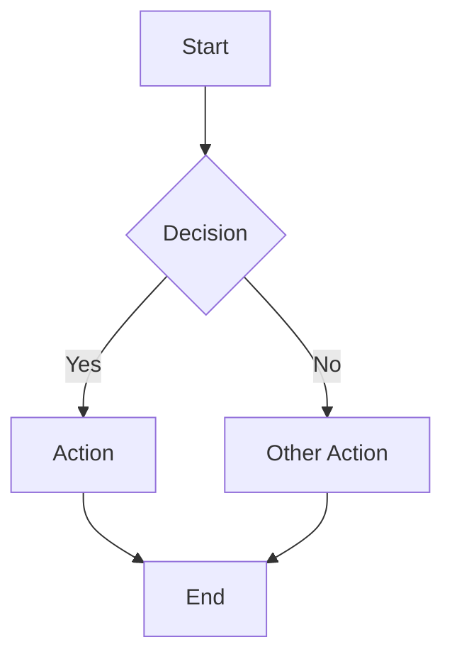
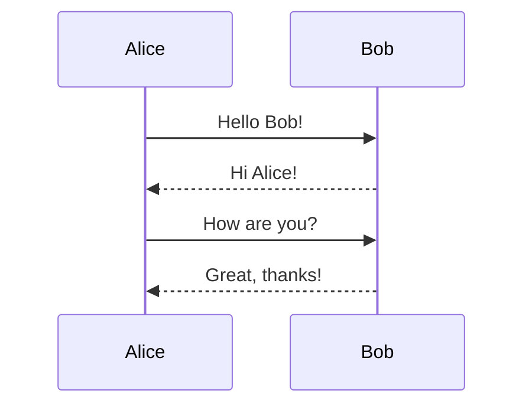
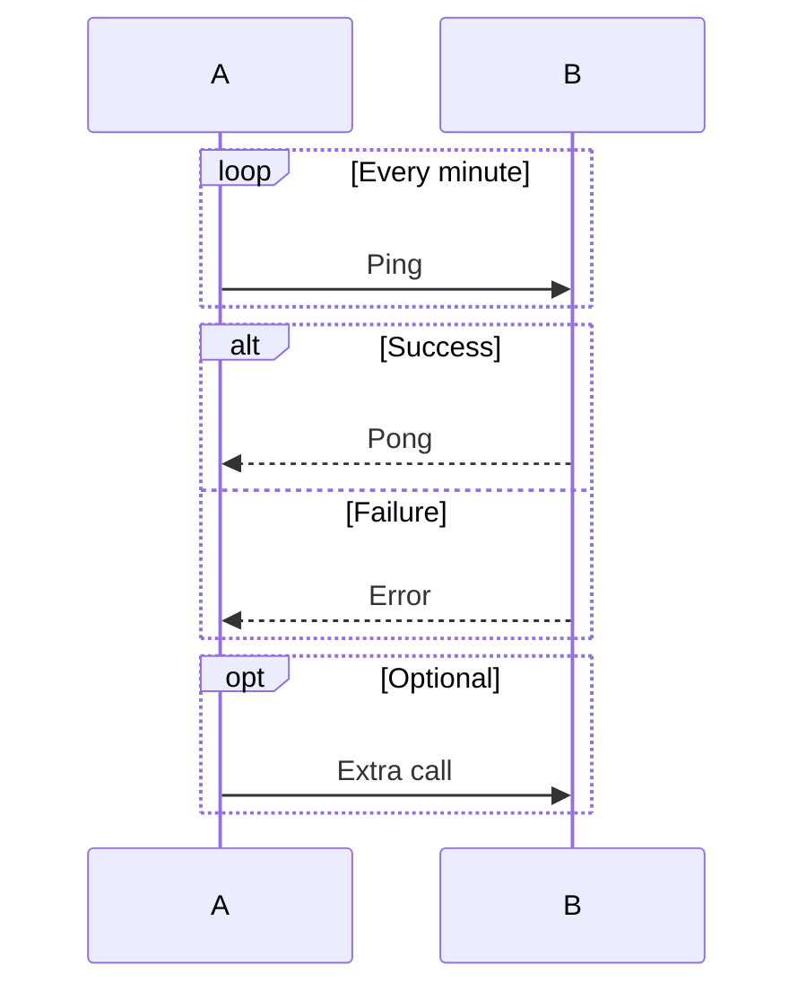
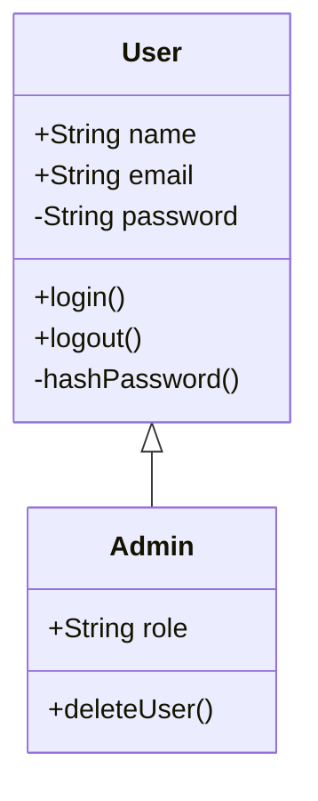

# Mermaid Import

Draph supports importing diagrams from Mermaid syntax. Paste your Mermaid code and get an editable visual diagram.

## How to Import

1. Press `M` or click the Mermaid button in the left toolbar
2. Paste your Mermaid code in the editor
3. Click "Import" or press `Ctrl+Enter`
4. Your diagram appears on the canvas, fully editable

<!-- TODO: Add screenshot of Mermaid import modal -->

## Supported Diagram Types

### Flowcharts



**Directions:**
- `TD` / `TB` - Top to bottom
- `LR` - Left to right
- `RL` - Right to left
- `BT` - Bottom to top

**Node Shapes:**
| Syntax | Shape |
|--------|-------|
| `A[text]` | Rectangle |
| `A(text)` | Pill (rounded) |
| `A{text}` | Diamond |
| `A((text))` | Circle |
| `A[["text"]]` | Container |

**Connections:**
| Syntax | Description |
|--------|-------------|
| `-->` | Arrow |
| `---` | Line (no arrow) |
| `-.->` | Dotted arrow |
| `==>` | Thick arrow |
| `--\|label\|-->` | Arrow with label |

### Sequence Diagrams



**Participants:**
- `participant A` - Basic participant
- `participant A as Alice` - Participant with alias
- `actor A as Alice` - Actor (stick figure)

**Messages:**
| Syntax | Description |
|--------|-------------|
| `->>` | Solid arrow (sync call) |
| `-->>` | Dashed arrow (response) |
| `-)` | Open arrow (async) |
| `--)` | Dashed open arrow |

**Blocks:**


### Class Diagrams



**Visibility:**
- `+` Public
- `-` Private
- `#` Protected
- `~` Package

**Relationships:**
| Syntax | Type |
|--------|------|
| `<\|--` | Inheritance |
| `*--` | Composition |
| `o--` | Aggregation |
| `-->` | Association |
| `..>` | Dependency |

## Limitations

Not all Mermaid features are supported. Current limitations:

- **Subgraphs** - Partially supported as containers
- **Styling** - Inline styles (`style A fill:#f00`) not supported
- **Links** - Click handlers not supported
- **Icons** - Font Awesome icons not supported
- **Notes** - Sequence diagram notes partially supported

## Tips

- **Edit after import** - Mermaid gives you a starting point; refine positioning manually
- **Auto-arrange** - Press `A` after import to clean up layout
- **Keep it simple** - Complex Mermaid diagrams may need manual adjustment
- **Iterate** - Import, tweak, export - use Draph as your visual editor

## API Usage

You can also create diagrams from Mermaid via the API:

```bash
curl -X POST https://draph.sanath.dev/api/diagram \
  -H "Content-Type: application/json" \
  -d '{"mermaid": "flowchart TD\n    A[Start] --> B[End]"}'
```

See [API Reference](api-reference.md) for details.
